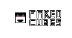

# About
Faked Cubes is a moddable, social deduction game made using [Godot Engine](https://godotengine.org)

This game adds many gamemodes such as **Deathmatch**, and uses [Lua API](https://github.com/WeaselGames/godot_luaAPI) for Modding.

# Opening the project

If you want to open this project, you will need **Godot 4.3**, download this version if you haven't already.

Clone this repository by running this command: `git clone https://github.com/SorioG/FakedCubes.git`

Open the editor and import this project, you can now start editing.
